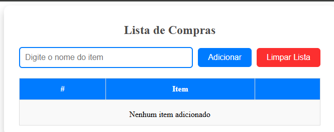

# 🅰️ Conceitos Básicos

Este projeto faz parte da primeira seção do curso, onde são abordados os **conceitos fundamentais do Angular**, criando uma aplicação prática: uma **Lista de Compras** interativa.

---

## 🧠 Conceitos aprendidos nesta seção

- Introdução ao **Angular 19** e sua estrutura de projeto
- Conceito de **componentes**, **módulos** e **templates**
- Utilização de **property binding** e **event binding**
- Manipulação de **diretivas estruturais** (`*ngFor`, `*ngIf`)
- Criação e uso de **formularios reativos (Reactive Forms)**
- Interação entre **componentes e template**
- Aplicação de **estilos dinâmicos** com **Bootstrap** e classes condicionais

---

## 🖥️ Funcionalidades da aplicação

A aplicação “**Lista de Compras**” implementa as principais funcionalidades aprendidas até esta etapa do curso:

- ➕ **Adicionar itens à lista**  
  O usuário digita o nome do item e clica em **Adicionar** para incluir na lista.

- 🗑️ **Limpar lista completa**  
  Ao clicar em **Limpar Lista**, todos os itens são removidos do armazenamento local e da tela.

- ✅ **Marcar itens concluídos**  
  Cada item possui uma checkbox para marcar como comprado.

- ⚠️ **Validação de campo obrigatório**  
  Caso o usuário tente adicionar um item vazio, uma mensagem de erro é exibida em vermelho:  
  **“Campo obrigatório”**.

---

## 🖼️ Interface da aplicação

Abaixo, o resultado da primeira seção do curso:

## 
