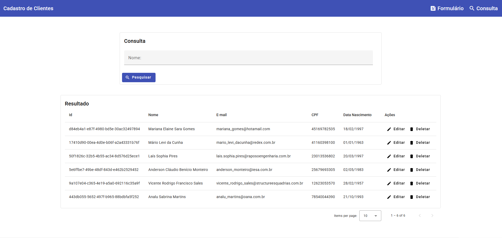
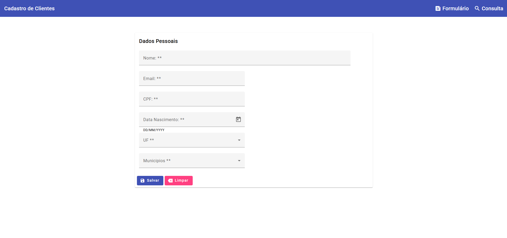
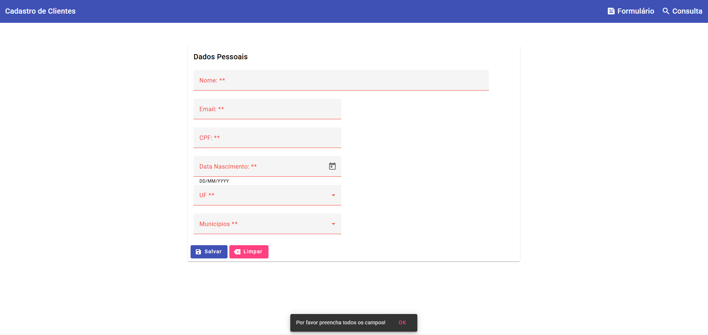
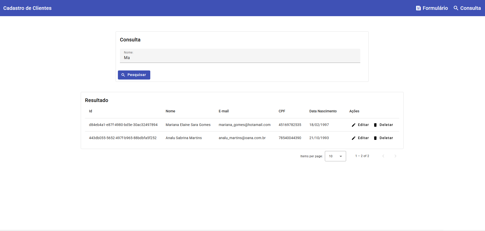

# 🅰️ CRUD com Angular Material

**Objetivo:** Construir uma aplicação completa de **cadastro de clientes** com **Angular 19** e **Angular Material**, aplicando boas práticas de desenvolvimento, organização de componentes e manipulação de dados locais.

---

## ⚙️ Funcionalidades Principais

✅ **Cadastro de Clientes**

- Formulário reativo com validação visual e mensagens de erro personalizadas.
- Campos obrigatórios com feedback visual utilizando `MatFormField` e `FormControl`.
- Máscaras de CPF e data de nascimento.

✅ **Listagem e Consulta de Clientes**

- Exibição dos registros em uma **tabela responsiva** (`MatTable`).
- **Ordenação e Paginação** integradas com `MatSort` e `MatPaginator`.
- Campo de pesquisa por nome com filtro dinâmico.

✅ **Edição e Exclusão**

- Ações de **Editar** e **Deletar** com ícones do Angular Material.
- Atualização instantânea da lista após edição ou remoção.

✅ **Feedback ao Usuário**

- Exibição de mensagens via `MatSnackBar` para ações como salvar, limpar e validar campos.
- Cores e layout inspirados no **Material Design**.

✅ **Armazenamento Local**

- Utilização de `localStorage` para salvar os dados do cliente.
- Serviço dedicado para abstrair as operações de persistência e busca (`ClienteService`).

---

## 🧠 Conceitos Aplicados

- **Componentização:** Separação de componentes de formulário, listagem e layout.
- **Data Binding:** Uso de `[(ngModel)]` e `FormControl` para sincronização de dados.
- **Angular Material:** Integração completa de tabelas, inputs, botões, diálogos e feedback visual.
- **Reactive Forms:** Controle e validação de formulários dinâmicos.
- **Lifecycle Hooks:** Uso de `ngOnInit`, `ngAfterViewInit` e `ngDoCheck`.
- **Boas práticas:** Reutilização de componentes e injeção de dependências com `@Injectable`.

---

## 📚 Tecnologias Utilizadas

- **Angular 19**
- **Angular Material 19**
- **brasilapi**
- **TypeScript**
- **RxJS**
- **HTML / SCSS**
- **LocalStorage API**

---

## 🧪 Como Executar o Projeto

```bash
# 1️⃣ Clonar o repositório
git clone https://github.com/seu-usuario/angular19-crud-material.git

# 2️⃣ Acessar a pasta do projeto
cd angular19-crud-material

# 3️⃣ Instalar as dependências
npm install

# 4️⃣ Executar o servidor de desenvolvimento
ng serve

# 5️⃣ Acessar no navegador
http://localhost:4200
```

---

## 🖼️ Interface do Projeto



## 🖼️ Interface do Cadastro



## 🖼️ Interface da Validação do Cadastro



## 🖼️ Interface da Edição do Cadastro


## 🖼️ Interface da Busca de Clientes


