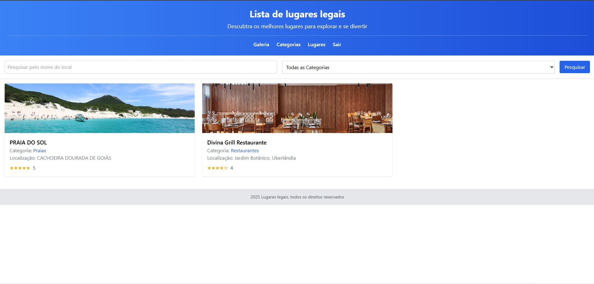
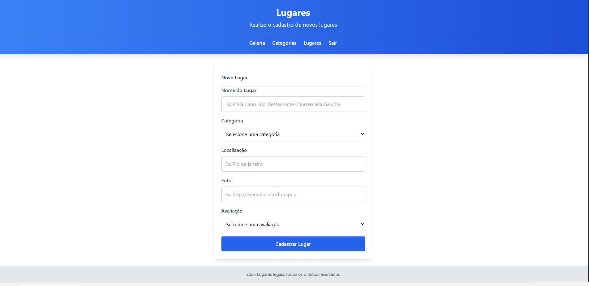

# 🧭 Passeio App

Uma aplicação Angular para listar e gerenciar passeios e lugares, com API simulada via `json-server`.

**Status:** Em desenvolvimento

## 🛠️ Tecnologias

- Angular 19
- TailwindCSS
- json-server (API fake / desenvolvimento)
- TypeScript

## ⚙️ Requisitos

- Node.js: recomendado 18.x (LTS) ou 20.x (LTS)
- npm (vem com Node.js)

> Observação: o repositório não define o campo `engines` no `package.json`. Testado com Node.js LTS (18/20).

## 🚀 Instalação

1. Clone o repositório

```bash
git clone https://github.com/marcionavarro/udemy-angular19
cd passeio-app
```

2. Instale dependências

```bash
npm install
```

## ▶️ Como rodar (desenvolvimento)

- Rodar a aplicação Angular (frontend):

```bash
npm start
# ou: npm run start
```

- Rodar a API fake (json-server):

```bash
npm run server
# ou para dados de produção de exemplo:
npm run server:production
```

Abra o frontend em `http://localhost:4200` e a API em `http://localhost:3000` (porta padrão do json-server).

Para rodar ambos simultaneamente, use dois terminais ou uma ferramenta de processos em paralelo.

## 🧪 Build

```bash
npm run build
```

## 🖼️ Screenshots





> Dica: coloque imagens com 1280×720 para visualização adequada no GitHub.

## 🔧 Estrutura principal

- `src/app` — código Angular (módulos: `categorias`, `lugares`, `galeria`, `template`, etc.)
- `api/db.json` — dados fake para desenvolvimento
- `public/` — arquivos públicos

## ✅ Observações

- Scripts úteis no `package.json`:
  - `start` — inicia o frontend (`ng serve`)
  - `server` — inicia o `json-server` com `api/db.json`
  - `server:production` — inicia o `json-server` com `api/db.production.json` na porta `4000`
